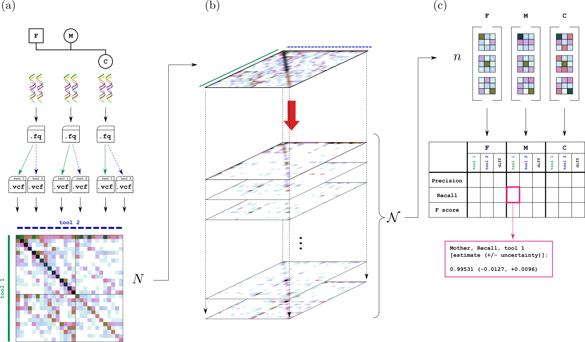

# Genotype Error Comparator Kit

Genotype Error Comparator Kit is implemented as a python package ```geck```, which estimates and compares the accuracies of two genotyping methods using only their joint result on a family trio.

```geck``` requires a joint histogram of genotype trio calls as input, and it fits a statistical mixture model and estimates the posterior distributions of genotype confusion matrices and benchmarking metrics: precision, recall, F-score.
The image below illustrates the data processing pipeline involved. ```geck``` performs the steps marked by (b) and (c).



See pre-print ["geck: trio-based comparative benchmarking of variant calls"](https://www.biorxiv.org/content/early/2017/10/23/208116) by P. Komar and D. Kural for detailed description.

## Licensing
GECK is available under the GNU General Public License v3. The GPL v3 is an open-source license that guarantees the freedom to share and change the software, and to make sure it remains free software for all its users. Seven Bridges also offers a commercial license for GECK.  Please contact [legal@sbgenomics.com](mailto:legal@sbgenomics.com) for more information.

## Requirements
This project requires Python 2.7, and numpy, scipy, pysam.

## Installation
1. ```git clone https://github.com/sbg/geck.git```
2. ```cd geck```
3. ```pip install -e .```


## How to use
To test the main functionality of ```geck```, run [gibbs_example.py](./examples/gibbs_example.py)

```python
import sys
import numpy
sys.path.append('../../geck')
from data import GeckData
from solverGibbs import GeckSolverGibbs
from postprocess import GeckResults

tool_names = ['tool1', 'tool2']
data_file = './example_input.txt'

print 'Loading data'
data = GeckData()
data.load_file(tool_names, data_file)

print 'Initializing Gibbs sampler'
solver = GeckSolverGibbs()
solver.import_data(data)
print 'Running Gibbs sampler...'
numpy.random.seed(12345)
solver.run_sampling(burnin=5000,
                    every=100,
                    iterations=int(1e4),
                    verbose=True)
print 'Done'

print 'Analyzing results...'
results = GeckResults(tool_names, solver.Ncomplete_samples)

# e.g.
print 'Estimated joint confusion matrix, n[i,j,k] (father):'
print 'rows: GT called by tool1 (0/0, 0/1, 1/1)'
print 'cols: GT called by tool2 (0/0, 0/1, 1/1)'
n_avg = results.confusion_matrix('father').avg()
print 'true GT: 0/0'
print n_avg[0, :, :].astype(int)
print 'true GT: 0/1'
print n_avg[1, :, :].astype(int)
print 'true GT: 1/1'
print n_avg[2, :, :].astype(int)
print ''

# e.g.
print 'F score (hard) difference (+ 5th, 95th percentiles) (mother)'
F_delta = results.Fscore('mother')['hard']['diff'].avg()
F_delta_low = results.Fscore('mother')['hard']['diff'].percentile(0.05)
F_delta_high = results.Fscore('mother')['hard']['diff'].percentile(0.95)
print str(F_delta) + ' (' + str(F_delta_low) + ', ' + str(F_delta_high) + ')'
print ''

# Full report
print results.report_metrics(mode='all',
                             person='all',
                             percentiles=(0.05, 0.95))
```

The following output will be produced in stdout (```[...]``` indicates more lines not explicitly shown here):

```
Loading data
Initializing Gibbs sampler
Running Gibbs sampler...
[...]
5000 iterations burned
[...]
10000 iterations done, 100 samples collected
Done
Analyzing results...
Estimated joint confusion matrix, n[i,j,k] (father):
rows: GT called by tool1 (0/0, 0/1, 1/1)
cols: GT called by tool2 (0/0, 0/1, 1/1)
true GT: 0/0
[[105021     20     62]
 [    36   1724     30]
 [    21      9     28]]
true GT: 0/1
[[    80     89    376]
 [    31 546716    200]
 [   286    177     69]]
true GT: 1/1
[[   274     21    153]
 [    86   1568     46]
 [   161    234 342468]]

F score (hard) difference (+ 5th, 95th percentiles) (mother)
-0.000248444692977 (-0.00029884362273, -0.000199081984341)

GECK report
Estimated benchmarking metrics [format: average, (5.0th, 95.0th percentiles)]
-----------------------------------------------------------------------------

father

precision (soft)
tool1: 0.99792889585 (0.997448260432, 0.998484170489)
tool2: 0.997900950783 (0.997420581655, 0.998453020134)
diff: -2.79450666498e-05 (-4.33716416989e-05, -9.81947492484e-06)

recall (soft)
tool1: 0.998885299315 (0.998832765384, 0.998933993839)
tool2: 0.998969069397 (0.998916677019, 0.999021755311)
diff: 8.37700820963e-05 (6.83183275673e-05, 0.000101910200315)

F score (soft)
tool1: 0.998406839742 (0.998159556592, 0.998666274307)
tool2: 0.998434695625 (0.998189244392, 0.998707087299)
diff: 2.78558822324e-05 (1.24064021072e-05, 4.59824123333e-05)

[...]
-----------------------------------------------------------------------------
```